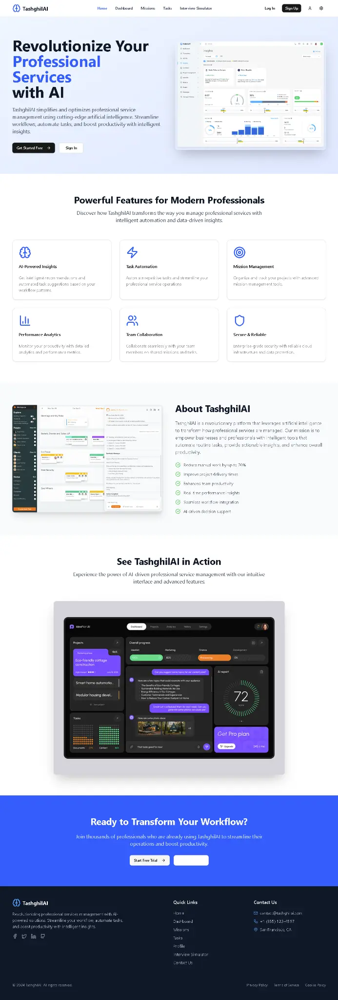
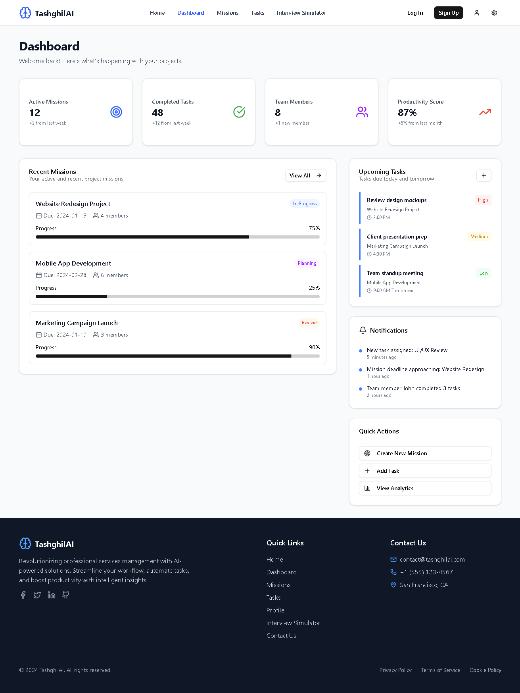
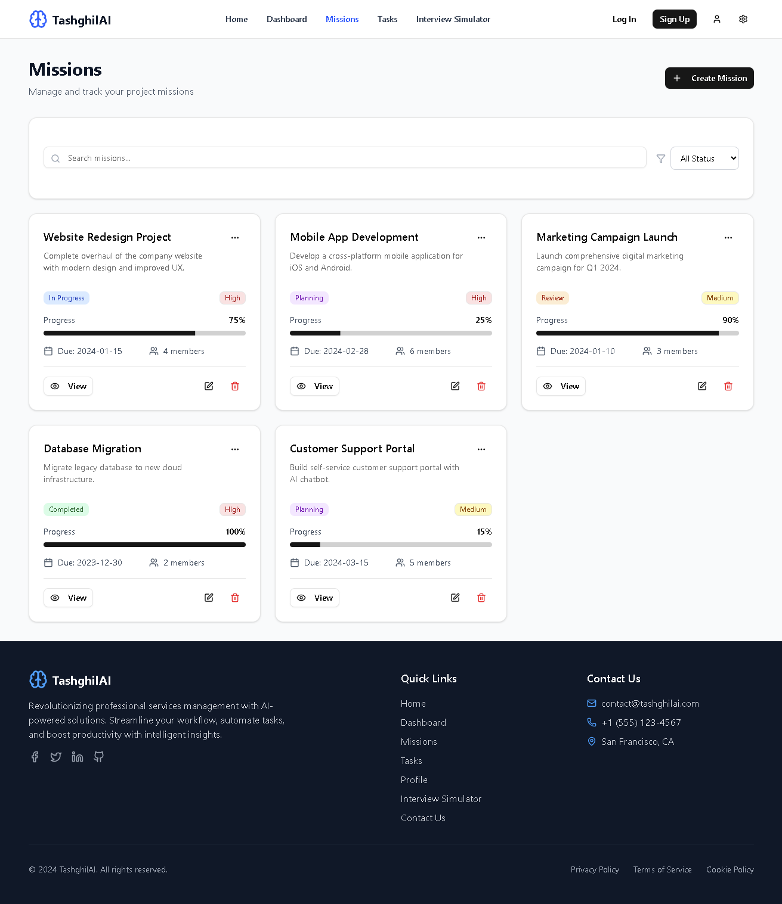
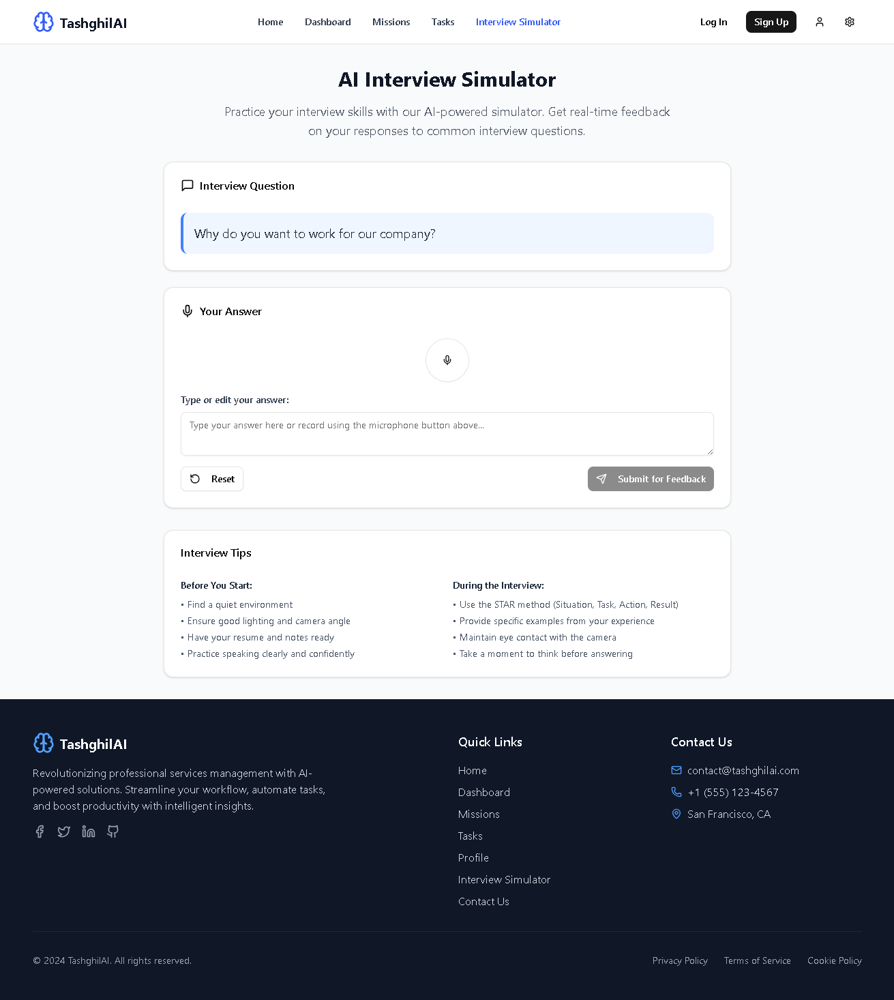
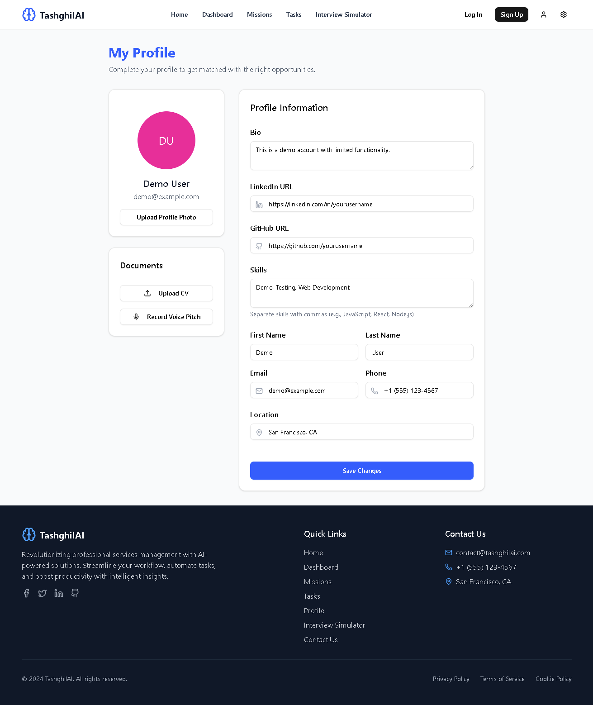
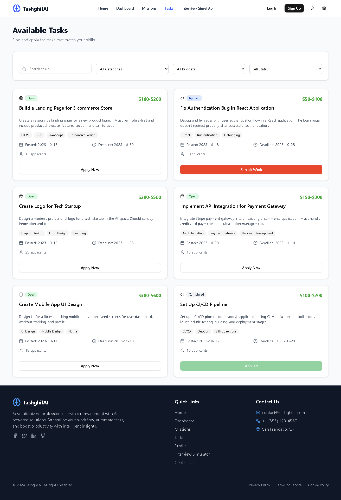
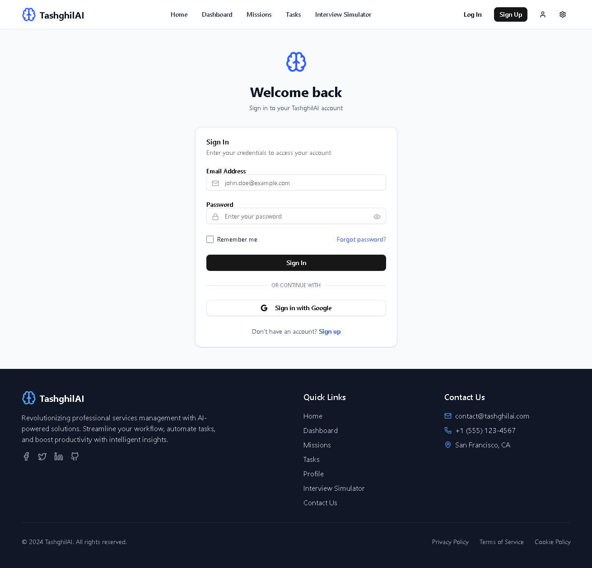
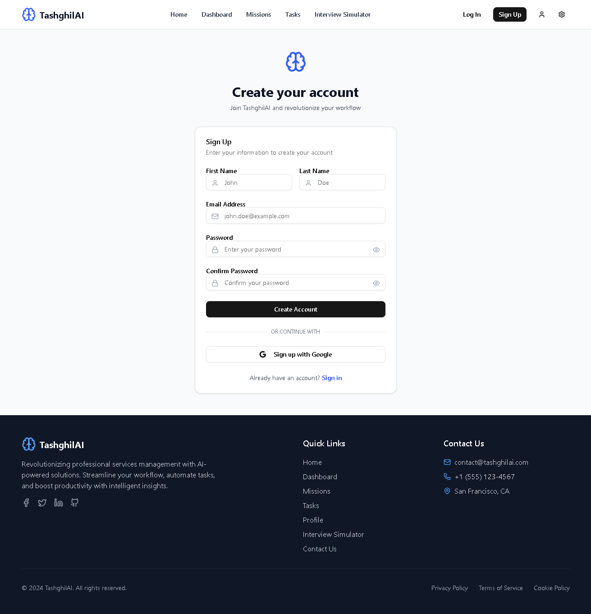
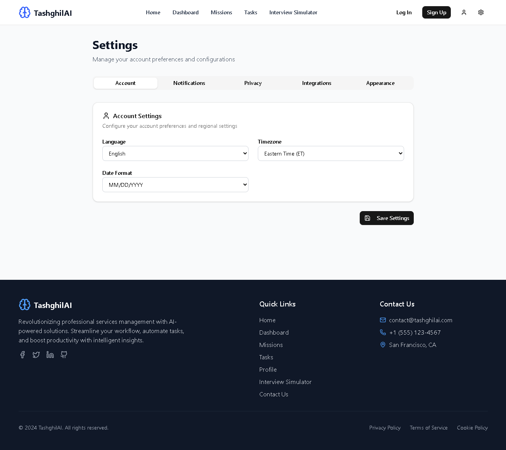

# TashghilAI

🚧 Project Status
This project is not completed. TashghilAI is an MVP (Minimum Viable Product) that I developed during the ENSET Hackathon 2025. It serves as a prototype and is not intended for production use.


## 🚀 Project Overview

TashghilAI is an AI-powered platform designed to revolutionize professional services management. It streamlines workflows, automates routine tasks, and provides intelligent insights to enhance overall productivity for businesses and professionals. This project serves as a comprehensive solution for managing missions, tasks, and user profiles, with advanced features like an AI Interview Simulator.

## ✨ Features

-   **AI-Powered Professional Services Management**: Automate and optimize your service delivery.
-   **Intuitive Dashboard**: Get a quick overview of your projects, missions, and tasks.
-   **Mission & Task Management**: Efficiently manage and track all your professional missions and individual tasks.
-   **AI Interview Simulator**: Practice and improve your interview skills with AI-driven feedback.
-   **Comprehensive User Profiles**: Detailed profiles including skills, LinkedIn/GitHub integration, CV upload, and voice pitch recording.
-   **Contact Us Page**: Easy communication channel for inquiries and support.
-   **Modern & Responsive UI**: Built with React and Tailwind CSS for a seamless experience across all devices.

## 📸 Screenshots

Below are some screenshots of the application interface:

### Home Page


### Dashboard


### Missions Page


### Interview Simulator


### Profile Page


### Tasks Page


### Login Page


### Sign Up Page


### Settings Page


## 🛠️ Technologies Used

-   **Frontend**: React.js, React Router, Tailwind CSS, Shadcn/UI, Lucide React
-   **Package Manager**: pnpm

## ⚙️ Installation

To get a local copy up and running, follow these simple steps.

### Prerequisites

Make sure you have Node.js (v18 or higher recommended) and pnpm installed on your system.

-   [Node.js](https://nodejs.org/)
-   [pnpm](https://pnpm.io/installation)

### Clone the repository

```bash
git clone [YOUR_REPOSITORY_URL_HERE]
cd tashghil-ai # Or the name of your extracted folder, e.g., AI
```

### Install dependencies

```bash
pnpm install
```

### Start the development server

```bash
pnpm run dev
```

Open your browser and visit:

[http://localhost:5174](http://localhost:5174)

## 🚀 Deployment

To build the project for production, run:

```bash
pnpm run build
```

The production-ready files will be generated in the `dist/` directory. You can then deploy these static files to any web server (e.g., Netlify, Vercel, Nginx, Apache).

## 🤝 Contributing

We welcome contributions to make TashghilAI even better! Here's how you can contribute:

1.  Fork the repository.
2.  Create a new branch (`git checkout -b feature/your-feature-name`).
3.  Make your changes and commit them (`git commit -m 'Add new feature'`).
4.  Push to the branch (`git push origin feature/your-feature-name`).
5.  Open a Pull Request.

## 📄 License

Distributed under the MIT License. See `LICENSE` for more information.

## 📧 Contact

Project Link: [YOUR_PROJECT_LINK_HERE]
Email: contact@tashghilai.com

---

**Note**: Replace `[YOUR_REPOSITORY_URL_HERE]` and `[YOUR_PROJECT_LINK_HERE]` with your actual repository and deployed project URLs.

